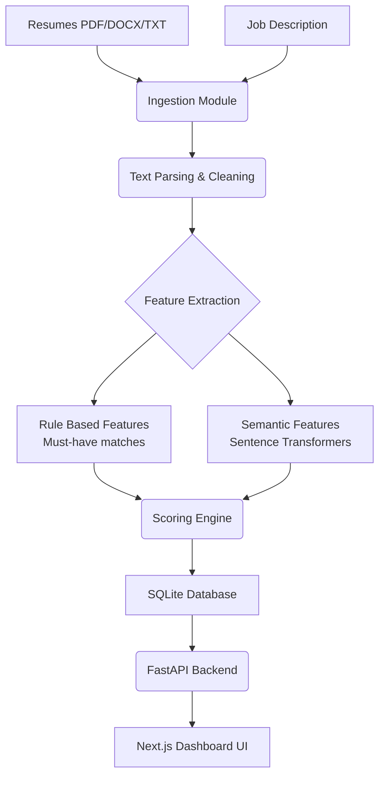

# Project Explanation & Architecture Guide

## 1. What is an Automated Resume Screening Tool?

**Simple Explanation:**
It's a computer program that acts like a digital HR assistant. When hundreds of people apply for a job, instead of a human reading every single resume, this tool reads them all in seconds. It looks for the required skills and experience, and tells the recruiter which candidates are the best match for the job.

**Technical Explanation:**
It's a Natural Language Processing (NLP) pipeline that ingests unstructured text (resumes), normalizes it, and extracts structured entities (skills, years of experience). It then generates dense vector embeddings of both the resume and the job description to calculate semantic similarity using cosine distance. Finally, a composite scoring algorithm blends rule-based boolean matching (must-have skills) with the semantic similarity to produce a final ranked output.

## 2. Why is it Important?
- **Saves Time:** Cuts down 50-70% of manual CV screening time.
- **Removes Bias:** Evaluates candidates strictly on skills and experience, ignoring demographic data.
- **Consistency:** Ensures every resume is graded against the exact same rubric.

## 3. The Workflow
`Resume Upload` → `Text Extraction (PyPDF2/DOCX)` → `Text Cleaning & Tokenization` → `Skill/Entity Extraction (Regex & Fuzzy Matching)` → `Feature Engineering (Embeddings)` → `Score Calculation (Weighted Formula)` → `Shortlist Decision` → `Report Generation & Dashboard Visualization`.

## 4. Architecture Diagram

## 5. Virtual Simulation Strategy
Because you do not have access to real ATS systems, you will simulate the process:
1. **Mock Data Generation:** You created 3 synthetic resumes (`data/sample_resumes/`) and a mock Job Description (`data/sample_job_descriptions.json`).
2. **Uploading:** Use `upload_demo.py` to programmatically POST these resumes to the FastAPI server, mimicking a candidate submitting an application via a portal.
3. **Execution:** Use the Next.js dashboard to click "Create Demo Job" and "Analyze Candidates", simulating a recruiter reviewing the talent pool.
4. **Outputs to Save:** Take a screenshot of the Next.js dashboard showing the bar chart and the ranked list to use as proof of work.
